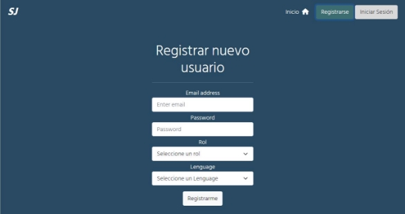



#Desafío - Soft Jobs

Para realizar este desafío debes haber estudiado previamente todo el material disponible correspondiente a la unidad.

Lee todo el documento antes de comenzar el desarrollo **individual**,para asegurarte de tener el máximo puntaje y enfocar bien los esfuerzos.

- Desarrollo desafío:
   - Para la realización del desafío necesitarás apoyarte del archivo *Apoyo Desafío Soft Jobs*

###Descripción

La empresa *Soft Jobs* ha iniciado el desarrollo de una plataforma que busca apoyar a la comunidad de desarrolladores juniors a conseguir trabajos cortos y sencillos para acumular experiencia laboral y mejorar sus oportunidades.

En este desafío serás *backend developer* de la empresa y deberás crear un servidor para la autenticación y autorización de usuarios usando JWT.

Deberás descargar el material de apoyo en el que encontrarás una aplicación cliente desarrollada con React preparada para consumir las rutas de tu servidor.

A continuación te mostramos imágenes de la aplicación cliente disponible en el material de apoyo.


Imagen 1. Página de Inicio Fuente: Desafío Latam
<br />


Imagen 2. Registro de Usuario Fuente: Desafío Latam
<br />


Imagen 3. Inicio de sesión Fuente: Desafío Latam
<br />


Imagen 4. Mi Perfil Fuente: Desafío Latam
<br />

Para realizar este desafío necesitarás ejecutar el siguiente script *sql* en tu terminal ***psql*** para crear la base de datos y la tabla que utilizaremos:

```SQL
CREATE DATABASE softjobs;
\c softjobs;
CREATE TABLE usuarios ( id SERIAL, email VARCHAR(50) NOT NULL, password VARCHAR(60) NOT NULL, rol VARCHAR(25), lenguage VARCHAR(20) );
SELECT * FROM usuarios;
```

Tu servidor debe:

- Permitir el registro de nuevos usuarios a través de una ruta **POST /usuarios**
- Ofrecer la ruta **POST /login** que reciba las credenciales de un usuario y devuelva un ***token*** generado con JWT. Se debe incluir el ***payload*** del token el ***email*** del usuario registrado.
- Disponibilizar una ruta **GET /usuarios** para devolver los datos de un usuario en caso de que esté autenticado, para esto:
- Extraiga un ***token*** disponible en la propiedad *Authorization* de las cabeceras
- Verifique la validez del token usando la misma llave secreta usada en su firma
- Decodifique el token para obtener el ***email*** del usuario a buscar en su ***payload***
- Obtenga y devuelva el registro del usuario

###Requerimientos

1. Registrar y obtener usuarios de la base de datos **(1.5 puntos)**
1. Usar middlewares para **(2 puntos)**:
   1. Verificar la existencia de credenciales en la ruta que corresponda
   1. Validar el token recibido en las cabeceras en la ruta que corresponda
   1. Reportar por la terminal las consultas recibidas en el servidor
1. Firmar, verificar y decodificar tokens ***JWT* (3 puntos)**
1. Capturar y devolver los posibles errores que ocurran en el servidor **(0.5 puntos)**
1. Encriptar las contraseñas al momento de registrar nuevos usuarios **(3 puntos) 

 ¡Mucho éxito!
                                                                                                                  
